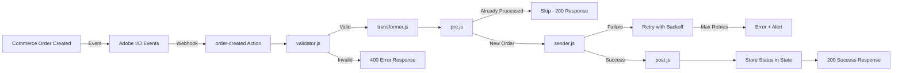

# Extension Architecture: Order Sync to ERP

<!--
  This document follows the ARCHITECTURE.md schema.
  Schema: references/architecture.schema.json
  All sections map to schema properties for consistent parsing by AI agents.
-->

## Document Control

| Field                   | Value                     |
| ----------------------- | ------------------------- |
| **Version**             | 1.0                       |
| **Status**              | approved                  |
| **Last Updated**        | 2025-01-20                |
| **Architect**           | Solutions Architect Agent |
| **Requirements Source** | REQUIREMENTS.md v1.0      |
| **Approval Date**       | 2025-01-19                |

---

## Environment

| Aspect               | Value      |
| -------------------- | ---------- |
| **Platform**         | saas       |
| **Application Type** | headless   |
| **Commerce Version** | 2.4.7      |
| **Runtime**          | Node.js 22 |

### Additional Constraints

- Must integrate with NetSuite ERP REST API v2
- SaaS environment requires IMS OAuth 2.0 (mandatory)
- Event provider registration may require manual verification after onboarding

---

## Integration Points

### Commerce Events (Commerce → External)

#### Event: sales_order_save_commit_after

- **Trigger**: When a new order is placed or an existing order is updated in Commerce
- **Event Type**: observer
- **Conditions**:
  - Only process when `_isNew` is `true` (new orders only)
  - Only process orders with `status` of `processing` or `complete`
- **Payload Fields** (from EVENTS_SCHEMA.json):

| Field             | Type       | Purpose                        |
| ----------------- | ---------- | ------------------------------ |
| `increment_id`    | string     | Order number for ERP reference |
| `grand_total`     | float      | Total order amount             |
| `customer_email`  | string     | Customer identifier            |
| `status`          | string     | Order status for filtering     |
| `payment`         | object{}   | Payment method details         |
| `items`           | object{}[] | Line items for ERP             |
| `addresses`       | object{}[] | Shipping/billing addresses     |
| `_isNew`          | boolean    | Distinguish create vs. update  |
| `created_at`      | string     | Order creation timestamp       |
| `currency_code`   | string     | Currency for ERP               |
| `shipping_amount` | float      | Shipping cost                  |
| `tax_amount`      | float      | Tax amount                     |

- **Action Path**: `actions/order/commerce/created/`

### External System: NetSuite ERP

| Aspect             | Value                              |
| ------------------ | ---------------------------------- |
| **Type**           | erp                                |
| **API Type**       | rest                               |
| **Authentication** | oauth2                             |
| **Base URL**       | `$NETSUITE_API_URL` (env variable) |
| **Data Flow**      | outbound (Commerce → NetSuite)     |
| **Rate Limits**    | 100 requests/minute                |

---

## Component Architecture

### Runtime Actions

#### Action: order-created

- **Path**: `actions/order/commerce/created/`
- **Files**: index.js, validator.js, pre.js, transformer.js, sender.js, post.js
- **Purpose**: Captures new Commerce orders and syncs them to NetSuite ERP as sales orders
- **Trigger**: `observer.sales_order_save_commit_after` (when `_isNew === true`)
- **File Details**:
  - **validator.js**: Verify webhook signature (HMAC-SHA256), validate timestamp (5-min window), check event type whitelist, verify required fields (`increment_id`, `grand_total`, `customer_email`)
  - **transformer.js**: Map Commerce order fields to NetSuite Sales Order format — `increment_id` → `externalId`, `grand_total` → `total`, concatenate address arrays, map line items with SKU/qty/price
  - **pre.js**: Check idempotency via aio-lib-state (`order-{increment_id}` key). If already processed, skip. Optionally enrich with additional Commerce API data if needed.
  - **sender.js**: POST to NetSuite REST API with OAuth 2.0 bearer token. Retry up to 3 times with exponential backoff (2s, 4s, 8s). Handle 429 rate limiting with delay.
  - **post.js**: Store sync status in aio-lib-state with 7-day TTL. Log success metrics. Trigger notification on failure.
- **Runtime Config**:
  - Runtime: `nodejs:22`
  - Web: `no` (event-driven, not web-accessible)
  - Timeout: `60000` (60 seconds)
  - Memory: `256` MB

### State Management

| Key Pattern                 | Purpose                                     | Storage | TTL                |
| --------------------------- | ------------------------------------------- | ------- | ------------------ |
| `order-sync-{increment_id}` | Track order sync status for idempotency     | state   | 7 days (604800s)   |
| `netsuite-auth-token`       | Cache OAuth token to reduce token exchanges | state   | 50 minutes (3000s) |

### Scheduled Actions

_None required for this integration — all operations are event-driven._

---

## Configuration Impact

### Files to Create/Update

| File                                                                    | Action | Details                                                                                                                                                                                                                        |
| ----------------------------------------------------------------------- | ------ | ------------------------------------------------------------------------------------------------------------------------------------------------------------------------------------------------------------------------------ |
| `scripts/commerce-event-subscribe/config/commerce-event-subscribe.json` | Update | Add `observer.sales_order_save_commit_after` with fields: `increment_id`, `grand_total`, `customer_email`, `status`, `payment`, `items`, `addresses`, `_isNew`, `created_at`, `currency_code`, `shipping_amount`, `tax_amount` |
| `scripts/onboarding/config/events.json`                                 | Update | Add order entity with `observer.sales_order_save_commit_after` event metadata and sample payload                                                                                                                               |
| `scripts/onboarding/config/starter-kit-registrations.json`              | Update | Add `order` entity with provider `commerce`                                                                                                                                                                                    |
| `app.config.yaml`                                                       | Update | Add `commerce-order` package with `order-created` action configuration                                                                                                                                                         |
| `env.dist`                                                              | Update | Add `NETSUITE_API_URL`, `NETSUITE_CLIENT_ID`, `NETSUITE_CLIENT_SECRET`, `NETSUITE_ACCOUNT_ID`                                                                                                                                  |

### Environment Variables

| Variable                 | Purpose                      | Example                                     | Required             |
| ------------------------ | ---------------------------- | ------------------------------------------- | -------------------- |
| `NETSUITE_API_URL`       | NetSuite REST API base URL   | `https://123456.suitetalk.api.netsuite.com` | Yes                  |
| `NETSUITE_CLIENT_ID`     | OAuth 2.0 client ID          | `abc123...`                                 | Yes                  |
| `NETSUITE_CLIENT_SECRET` | OAuth 2.0 client secret      | `xyz789...`                                 | Yes                  |
| `NETSUITE_ACCOUNT_ID`    | NetSuite account identifier  | `123456`                                    | Yes                  |
| `STATE_REGION`           | aio-lib-state region         | `amer`                                      | No (default: amer)   |
| `STATE_TTL`              | Default state TTL in seconds | `604800`                                    | No (default: 604800) |

### NPM Dependencies

| Package                | Purpose                                   | Version  |
| ---------------------- | ----------------------------------------- | -------- |
| `axios`                | HTTP client for NetSuite API calls        | `^1.7.0` |
| `@adobe/aio-lib-state` | State management for idempotency tracking | `^4.0.0` |
| `@adobe/aio-sdk`       | Core SDK for logging and utilities        | `^5.0.0` |

---

## Security Architecture

### Authentication

- **Method**: IMS OAuth 2.0 Server-to-Server (SaaS mandatory)
- **Pattern**: Service-to-service authentication for Runtime actions → Commerce API
- **External System Auth**: OAuth 2.0 Client Credentials for NetSuite API
- **Required Credentials** (as env vars):
  - `IMS_ORG_ID`
  - `IMS_CLIENT_ID`
  - `IMS_CLIENT_SECRET`
  - `ADOBE_IO_EVENTS_CLIENT_SECRET`
  - `NETSUITE_CLIENT_ID`
  - `NETSUITE_CLIENT_SECRET`

### Event Validation

- **Signature Verification**: Yes — HMAC-SHA256 using `ADOBE_IO_EVENTS_CLIENT_SECRET`
- **Timestamp Validation**: Yes — 5-minute window to prevent replay attacks
- **Event Type Whitelist**:
  - `com.adobe.commerce.observer.sales_order_save_commit_after`

### Secrets Management

- **Local Development**: `.env` file (gitignored), copied from `env.dist` template
- **Production**: GitHub Secrets injected during CI/CD deployment

### Data Protection

- Never log PII (customer email, addresses) — only log order `increment_id`
- All API calls use HTTPS
- Credentials stored as encrypted default parameters in app.config.yaml
- aio-lib-state encrypts data at rest

---

## Data Flow

### Description

When a new order is placed in Adobe Commerce, the platform emits a `sales_order_save_commit_after` event. The event is delivered to the App Builder runtime action via Adobe I/O Events. The action validates the event signature, checks for duplicate processing, transforms the Commerce order data into NetSuite's Sales Order format, and sends it via REST API. The sync status is stored in aio-lib-state for idempotency tracking.

### Diagram

### Key Transformations

| From (Commerce)          | To (NetSuite)     | Transformation                                                                |
| ------------------------ | ----------------- | ----------------------------------------------------------------------------- |
| `increment_id`           | `externalId`      | Direct mapping                                                                |
| `grand_total`            | `total`           | Parse as float                                                                |
| `customer_email`         | `email`           | Direct mapping                                                                |
| `items[]`                | `item.sublist[]`  | Map each item: `sku` → `itemId`, `qty_ordered` → `quantity`, `price` → `rate` |
| `addresses[]` (shipping) | `shippingAddress` | Find `address_type === 'shipping'`, concatenate street array                  |
| `addresses[]` (billing)  | `billingAddress`  | Find `address_type === 'billing'`, concatenate street array                   |
| `payment.method`         | `paymentMethod`   | Map Commerce payment code to NetSuite payment type                            |
| `currency_code`          | `currency`        | Map to NetSuite currency internal ID                                          |

---

## Error Handling Strategy

### Retry Policy

- **Max Retries**: 3
- **Backoff Type**: Exponential
- **Initial Delay**: 2 seconds (2s → 4s → 8s)

### Failure Scenarios

| Scenario                              | Handling                                           | Alerting                    |
| ------------------------------------- | -------------------------------------------------- | --------------------------- |
| NetSuite API returns 500              | Retry with exponential backoff (3 attempts)        | Log error after max retries |
| NetSuite API returns 429 (rate limit) | Wait for `Retry-After` header duration, then retry | Log warning                 |
| Invalid event signature               | Reject immediately with 400                        | Log security warning        |
| Missing required fields               | Reject with 400 and field name                     | Log validation error        |
| Duplicate order event                 | Skip processing (idempotent)                       | Log info                    |
| NetSuite API timeout                  | Retry with exponential backoff                     | Log error after max retries |

### Idempotency Strategy

- Use `order-sync-{increment_id}` key in aio-lib-state
- Before processing, check if key exists with status `completed`
- After successful send, store `{ status: 'completed', externalId: <netsuiteId>, timestamp: <iso> }`
- TTL of 7 days ensures cleanup while covering any delayed retry windows

---

## Performance Strategy

### Caching

| Data                 | Storage | TTL        | Invalidation    |
| -------------------- | ------- | ---------- | --------------- |
| NetSuite OAuth token | state   | 50 minutes | On 401 response |

### Scaling Considerations

- Actions are stateless and scale horizontally automatically
- NetSuite rate limit (100 req/min) is the bottleneck — sender.js handles 429 responses
- Peak scenario: Black Friday (3x normal volume ~600 orders/day) stays within rate limits
- aio-lib-state handles concurrent reads/writes for idempotency checks

---

## Testing Strategy Recommendations

### Unit Test Focus

- `validator.js` — Signature verification, timestamp validation, required fields check
- `transformer.js` — Field mapping accuracy, type conversions, null handling, array transformations
- `sender.js` — Retry logic, error handling, rate limit handling
- `pre.js` — Idempotency check logic
- `post.js` — State storage operations

### Integration Test Scenarios

- Complete happy path: valid order event → NetSuite sync → status stored
- Duplicate event handling: same order event twice → second skipped
- API failure recovery: NetSuite 500 → retry → eventual success
- Invalid event rejection: bad signature → 400 response

### Mock Requirements

- NetSuite REST API (axios calls)
- aio-lib-state (get/put/delete operations)
- Adobe I/O Events signature validation

### Coverage Target

- 80% minimum code coverage

---

## Decisions Log

| ID   | Decision                                              | Rationale                                                                             | Alternatives Considered                                                       |
| ---- | ----------------------------------------------------- | ------------------------------------------------------------------------------------- | ----------------------------------------------------------------------------- |
| AD-1 | Use `observer.sales_order_save_commit_after` event    | Provides complete order data after save commit; fields verified in EVENTS_SCHEMA.json | `sales_order_place_after` (less data), polling API (higher latency)           |
| AD-2 | Use aio-lib-state for idempotency (not aio-lib-files) | Sync status is small (<1KB), needs fast access, and auto-expires with TTL             | aio-lib-files (overkill for small data), external DB (prohibited)             |
| AD-3 | Headless application (no SPA)                         | Requirements specify backend-only data sync with no admin UI needed                   | SPA (unnecessary complexity for this use case)                                |
| AD-4 | OAuth 2.0 for NetSuite authentication                 | NetSuite recommends OAuth 2.0; aligns with IMS auth patterns                          | API Key (less secure), Token-based (deprecated by NetSuite)                   |
| AD-5 | Exponential backoff with 3 retries                    | Balances resilience with latency; prevents overwhelming NetSuite during outages       | Fixed delay (inefficient), No retry (fragile), Unlimited retries (dangerous)  |
| AD-6 | Filter by `_isNew === true` in validator              | Only sync new orders per requirements (FR-1); updates handled separately if needed    | Process all events (unnecessary load), Separate update handler (out of scope) |
| AD-7 | Cache NetSuite auth token in state (50-min TTL)       | Reduce token exchange calls; NetSuite tokens valid for 60 minutes                     | Request new token each time (wasteful), Longer TTL (risk of expiry)           |

---

## Approvals

| Role           | Name                      | Date       |
| -------------- | ------------------------- | ---------- |
| Architect      | Solutions Architect Agent | 2025-01-19 |
| Technical Lead |                           |            |
